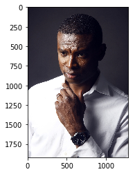
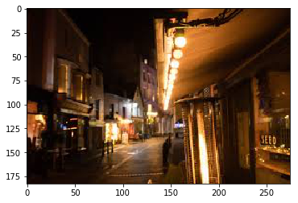

# MODELLING AND PREDICTION

Victor Mawusi Ayi


```python
import matplotlib.pyplot as plt
import matplotlib.image as mpimg
from sklearn.linear_model import LogisticRegression
from sklearn.neighbors import KNeighborsClassifier
from sklearn.neighbors.nearest_centroid import NearestCentroid

from data import Dataset
from features import (
    contrast,
    lightness,
    luminance,
    supracontrast,
    supralightness,
    supraluminance
)
from modelling import Model
from visualize import fsep

```


```python
image_dir_training = "day_night_images/training/"
image_dir_test = "day_night_images/test/"
image_size = (500, 500)

traindata = Dataset(image_dir_training, image_size=image_size)
testdata = Dataset(image_dir_test, image_size=image_size)

trainfs = traindata.featureset()
testfs = testdata.featureset()
```

# Models


```python
features = [
    "contrast",
    "supraluminance",
    "supracontrast",
    "supralightness",
    "luminance"
]
classes = traindata.classes
```


```python

def modeller(classifier):
    model = Model(
        classifier,
        classes,
        image_size,
        features
    )

    model.train(trainfs)
    testreport = model.test(testfs)
    print(testreport[0])
    print("Indexes of wrongly classified images:", testreport[1])
    
    return model

```

# Using Nearest Centroid


```python
ncent = modeller(NearestCentroid())
```

    OUTPUT:
    Overall Accuracy -> 99.38%
    
    Class Accuracies:
    Class 0: 80/80 --> 100.0%
    Class 1: 80/81 --> 98.77%
    Indexes of wrongly classified images: (114,)


```python
misfit = testdata.data[114]
print(ncent.predict(misfit))
plt.imshow(misfit)
```

    OUTPUT
    night
    
    <matplotlib.image.AxesImage at 0x7f1760464b38>


# Using Logistic Regression


```python
logreg = modeller(LogisticRegression(max_iter=6, intercept_scaling=18))
```

    OUTPUT:
    Overall Accuracy -> 97.52%
    
    Class Accuracies:
    Class 0: 80/80 --> 100.0%
    Class 1: 77/81 --> 95.06%
    Indexes of wrongly classified images: (123, 129, 143, 150)


```python
misfit = testdata.data[115]
print(logreg.predict(misfit))
plt.imshow(misfit)
```

    OUTPUT:
    day

    <matplotlib.image.AxesImage at 0x7f175ec020f0>


# Using K Nearest Neighbor


```python
knn = modeller(KNeighborsClassifier())
```

    OUTPUT:
    Overall Accuracy -> 100.0%
    
    Class Accuracies:
    Class 0: 80/80 --> 100.0%
    Class 1: 81/81 --> 100.0%
    Indexes of wrongly classified images: ()


```python
misfit = testdata.data[25]
print(knn.predict(misfit))
plt.imshow(misfit)
```

    OUTPUT:
    night

    <matplotlib.image.AxesImage at 0x7f175eb6a128>


# PREDICTING FOR RANDOM IMAGES


```python
def predict(imageurl):
    rgbimg = mpimg.imread(imageurl)
    print("NearestCentroid->{}, LogisticRegression->{}, K Nearest Neighbors->{}".format(
        ncent.predict(rgbimg),
        logreg.predict(rgbimg),
        knn.predict(rgbimg)
    ))

    plt.imshow(rgbimg)
```


```python
predict("images/test1.jpeg")
```

    MODEL PREDICTIONS:
    NearestCentroid->night, LogisticRegression->night, K Nearest Neighbors->night





```python
predict("images/test1.jpg")
```

    MODEL PREDICTIONS:
    NearestCentroid->day, LogisticRegression->night, K Nearest Neighbors->day


```python
predict("images/test2.jpg")
```

    MODEL PREDICTIONS:
    NearestCentroid->night, LogisticRegression->night, K Nearest Neighbors->night


```python
predict("images/test3.jpg")
```

    MODEL PREDICTIONS:
    NearestCentroid->night, LogisticRegression->night, K Nearest Neighbors->night


```python
predict("images/test4.jpg")
```

    MODEL PREDICTIONS:
    NearestCentroid->day, LogisticRegression->day, K Nearest Neighbors->day


```python
predict("images/test5.jpg")
```

    MODEL PREDICTIONS:
    NearestCentroid->night, LogisticRegression->night, K Nearest Neighbors->night


```python
predict("images/test6.jpg")
```

    MODEL PREDICTIONS:
    NearestCentroid->night, LogisticRegression->night, K Nearest Neighbors->night





```python
predict("images/test7.jpg")
```

    MODEL PREDICTIONS:
    NearestCentroid->day, LogisticRegression->day, K Nearest Neighbors->day


```python
predict("images/test8.jpg")
```

    MODEL PREDICTIONS:
    NearestCentroid->day, LogisticRegression->day, K Nearest Neighbors->day


```python
predict("images/test9.jpg")
```

    MODEL PREDICTIONS:
    NearestCentroid->day, LogisticRegression->night, K Nearest Neighbors->day


```python
predict("images/test10.jpg")
```

    MODEL PREDICTIONS:
    NearestCentroid->night, LogisticRegression->day, K Nearest Neighbors->night


```python
predict("images/test11.jpg")
```

    MODEL PREDICTIONS:
    NearestCentroid->day, LogisticRegression->day, K Nearest Neighbors->day


```python
predict("images/test12.jpg")
```

    MODEL PREDICTIONS:
    NearestCentroid->day, LogisticRegression->night, K Nearest Neighbors->day


```python
predict("images/test13.jpg")
```

    MODEL PREDICTIONS:
    NearestCentroid->day, LogisticRegression->day, K Nearest Neighbors->day


```python
predict("images/test14.jpg")
```

    MODEL PREDICTIONS:
    NearestCentroid->day, LogisticRegression->day, K Nearest Neighbors->day


```python

```
